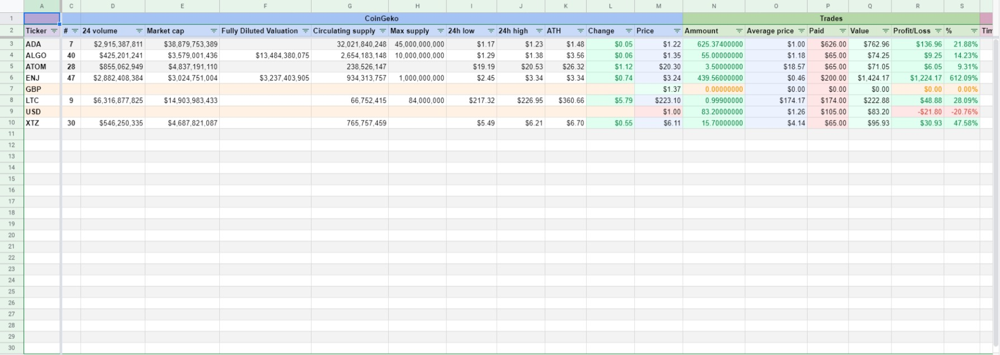

_This is a fork of the original **Crypto portfolio tracker for Google Sheets** work of [TechupBusiness](info@techupbusiness.com).
Any and all changes are hereby aligned to the same license conditions._

# CryptoBooks
This is a hobby project for tracking crypto investments built on top of an older sheet I found available under GPL and decided to update.
Use it at your own risk. You are solely responsible for the accuracy of your finances.

A code of conduct has been provided for the purpose of this fork, please read it before raising ANY issues of ANY kind.

# Google Sheet
[CryptoBooks Google Sheet v.2.0](https://docs.google.com/spreadsheets/d/1XtHY5pR4iVSAcTWN5QWn8-WTHEoQ2ALDIKXaPSvhQS8/)
is a demo Google Sheet that deploys this code.

In order to get started, make a copy of it in your Drive and read the
[Medium](https://mindup.medium.com/free-crypto-portfolio-tracker-based-on-google-sheets-ef76070ec325)
article of the original developer.

_Please do keep in mind at this point there are a lot of differences between this version and the article one._

# Screenshots

## Change list
- Version 1.1.0
    - Refactored the code a bit.
    - Added more logging (some disabled).
    - Fixed buggy calculations.
    - Added additional data type validations.
    - Anything else I forgot.

- Version 1.1.1
    - Fixed float leftovers for liquidated coins.

- Version 1.2.0
    - Removed Profit sheet and loops.
    - Added profit details to Dashboard.
    - Added new graphs to Dashboard sheet.

- Version 1.2.1
    - Disabled API calls without a key.
    - Changed the recommended ordering A-Z for mathematical sense
    - Improved defaults.

- Version 2.0
    - Replaced API with [CoinGecko](https://www.coingecko.com/) free API.
    - API's only used to pull FIAT and coin values.
    - Removed exchanges feature due to poor performance.
    - 98% complete rewrite.
    - Dynamic sheets formula used for all stats.
    - Corrected all calculations _(I hope)_.

- Version 2.0.1
    - Added formula for FIAT exchange rates.

- Version 2.0.2
    - Added daily flux for given asset.

- Version 2.0.3
    - Made trades have equality between buy adn sell fiat value.

- Version 2.0.4
    - Added Settings for FIAT currency and stable coins.

- Version 2.0.5
    - Fixed fiat values.

- Version 2.1
    - Added CryptoCompare API for FIAT rates.

## Planned updates
- Automatically add coin when adding trade.
- Add line graph to each coin.

_Don't hold your breath though._
