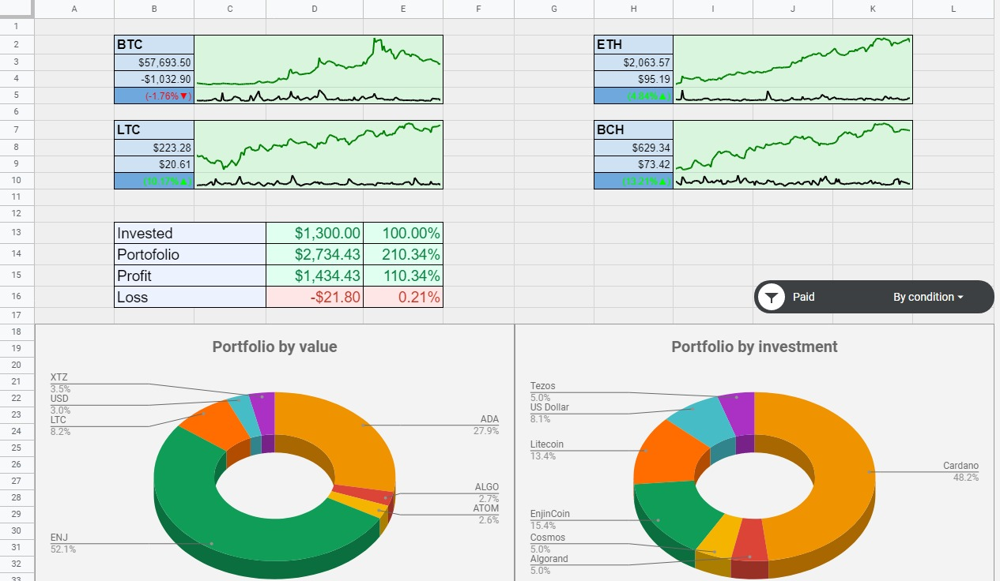
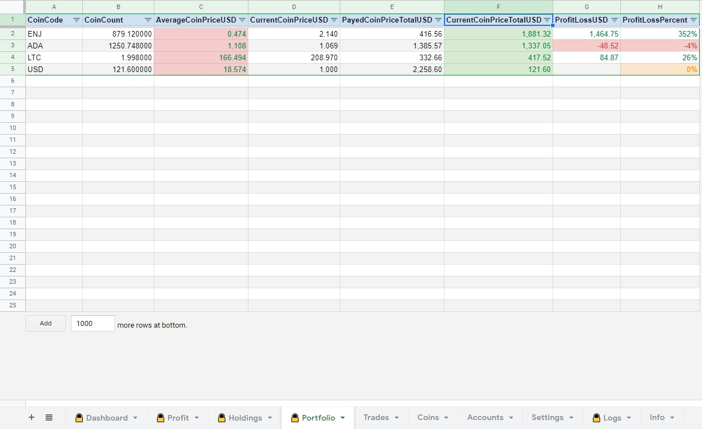
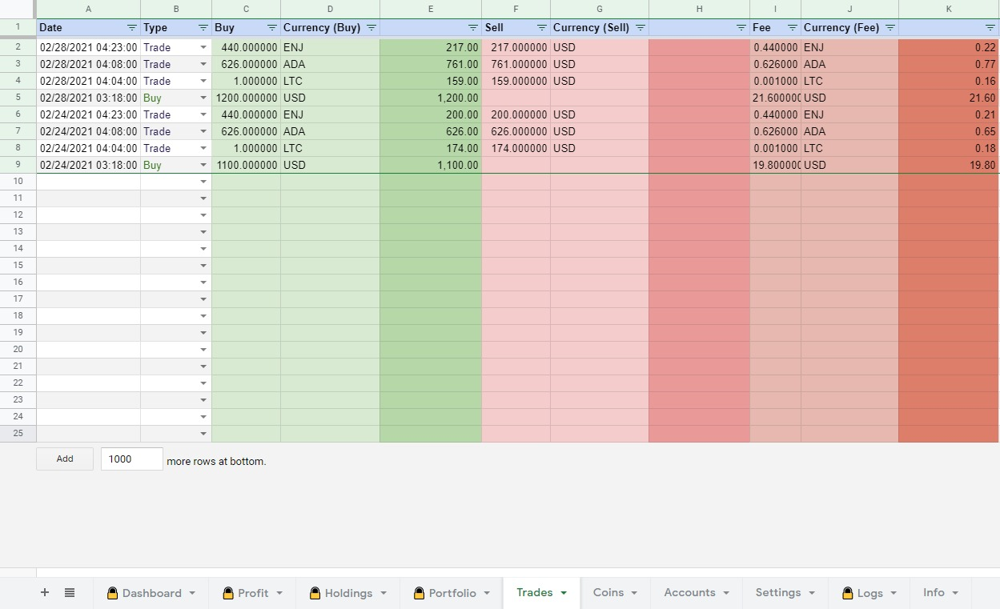

This is a fork of the original **Crypto portfolio tracker for Google Sheets** work of [TechupBusiness](info@techupbusiness.com).
Any and all changes are hereby aligned to the same license conditions.

# CryptoBooks
This is a fork of the original **Crypto portfolio tracker for Google Sheets** work of **TechupBusiness**.
Any and all changes are hereby aligned to the same license conditions.

A code of conduct has been provided for the purpose of this fork, please read it before raising any issues of any kind.

# Google Sheet
[CryptoBooks Google Sheet](https://docs.google.com/spreadsheets/d/1e5owlgcDlpt8PJhtJkwiKRHzZtyYzyPl7gJEgNtAA3o/)
is a demo Google Sheet that deploys this code.

In order to get started, make a copy of it in your Drive and read the
[Medium](https://mindup.medium.com/free-crypto-portfolio-tracker-based-on-google-sheets-ef76070ec325)
article of the original developer.

# Screenshots

## Change list
- Version 1.1.0
    - Refactored the code a bit.
    - Added more logging (some disabled).
    - Fixed buggy calculations.
    - Added additional data type validations.
    - Anything else I forgot.

- Version 1.1.1
    - Fixed float leftovers for liquidated coins.

- Version 1.2.0
    - Removed Profit sheet and loops.
    - Added profit details to Dashboard.
    - Added new graphs to Dashboard sheet.

## Planned updates
Don't hold your breath though.

- Add debug configuration options.
- Add debug executors.
- Refactor the code further.
- Add more APIs.
- Improve performance.
