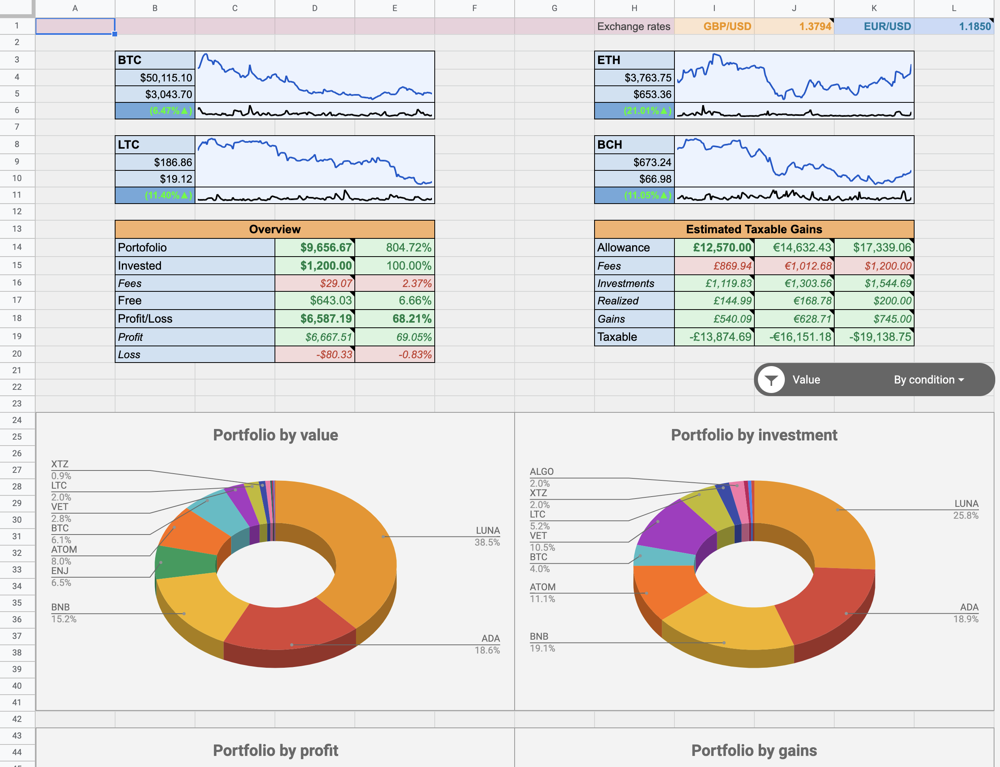
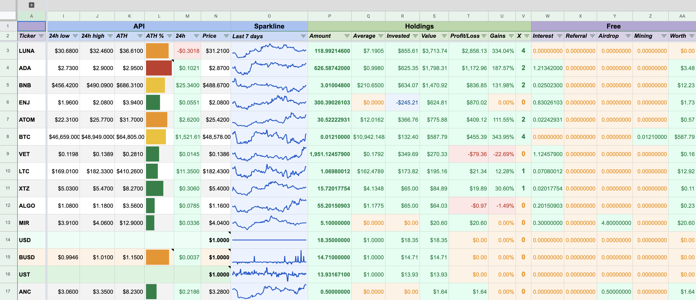
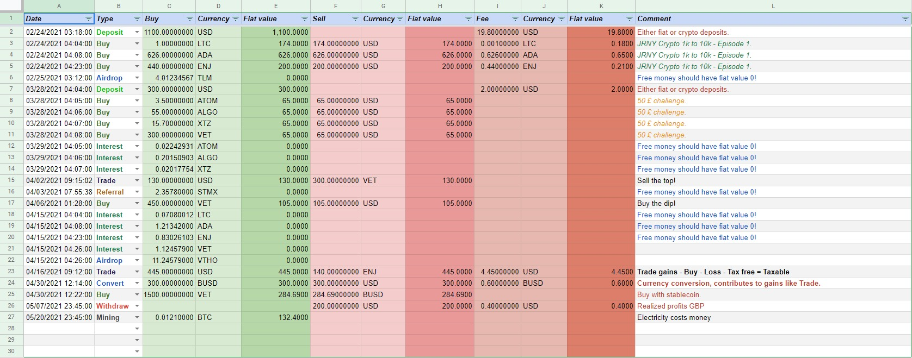
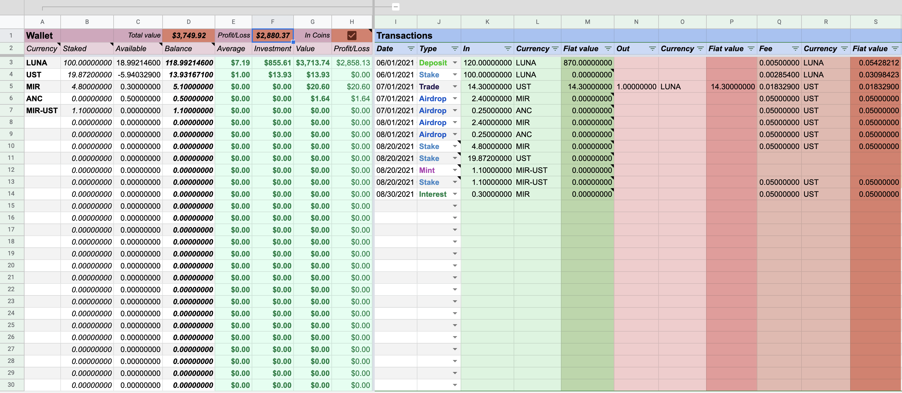
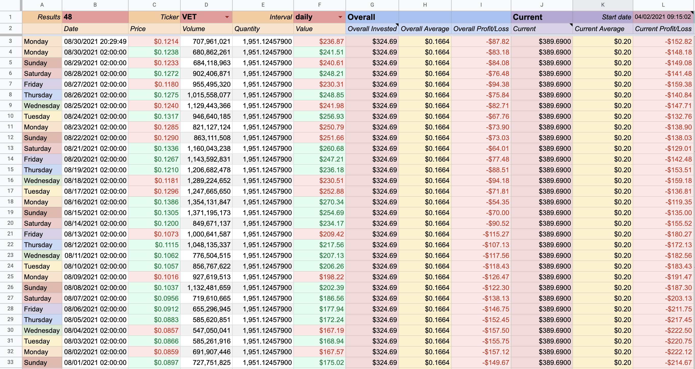
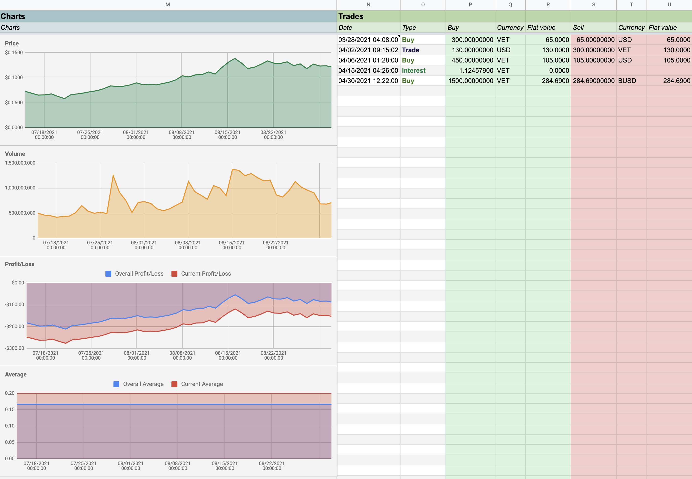
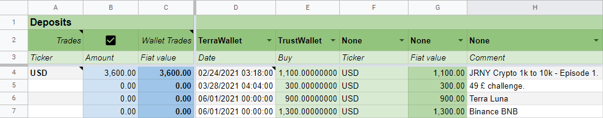
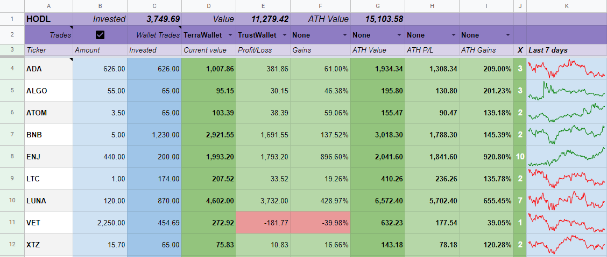

_This is a fork of the original **Crypto portfolio tracker for Google Sheets** work of [TechupBusiness](info@techupbusiness.com).
Any and all changes are hereby aligned to the same license conditions._

# CryptoBooks
This is a hobby project for tracking crypto investments built on top of an older sheet I found available under GPL and decided to update.
Use it at your own risk. You are solely responsible for the accuracy of your finances.

A code of conduct has been provided for the purpose of this fork, please read it before raising ANY issues of ANY kind.

# Google Sheet
[CryptoBooks Google Sheet v.2.0](https://docs.google.com/spreadsheets/d/1XtHY5pR4iVSAcTWN5QWn8-WTHEoQ2ALDIKXaPSvhQS8/)
is a demo Google Sheet that deploys this code.

In order to get started, make a copy of it in your Drive and read the
[Medium](https://mindup.medium.com/free-crypto-portfolio-tracker-based-on-google-sheets-ef76070ec325)
article of the original developer.

_Please do keep in mind at this point there are a lot of differences between this version and the article one._

# Screenshots
### Dashboard
This workbook shows a general outlook on your portfolio with a variety of graphs.

### Coins
The Coins workbook provides an individual asset outlook.

### Trades
The Trades workbook is where each individual trade is tracked.

### Wallet
Wallet workbooks can be many and can optionally contribute to Coins workbook.

### Flux
Idea utility for traders and singers to track individual investments flip by flip.

- It provides hourly or daily monitoring for a coin with Overall investment and Current flip stats so you will never lose track of your current and past profits. 

- It also displays the data in nice graphs and provides a printout of all trades associated with the coin.

_Flux cannot display Wallet trades._ 

### Deposits.
Deposits workbook shows all deposits in trades and selected wallets for accounting purposes.

### HODL
This workbook shows all purchases in trades and selected wallets and tracks their current and ATH value, P/L and gains.

## Change list
- Version 1.1
    - Refactored the code a bit.
    - Added more logging (some disabled).
    - Fixed buggy calculations.
    - Added additional data type validations.
    - Anything else I forgot.
    - Fixed float leftovers for liquidated coins.

- Version 1.2
    - Removed Profit sheet and loops.
    - Added profit details to Dashboard.
    - Added new graphs to Dashboard sheet.
    - Disabled API calls without a key.
    - Changed the recommended ordering A-Z for mathematical sense
    - Improved defaults.

- Version 2.0
    - Replaced API with [CoinGecko](https://www.coingecko.com/) free API.
    - API's only used to pull FIAT and coin values.
    - Removed exchanges feature due to poor performance.
    - 98% complete rewrite.
    - Dynamic sheets formula used for all stats.
    - Corrected all calculations.
    - Added formula for FIAT exchange rates.
    - Added daily flux for given asset.
    - Made trades have equality between buy adn sell fiat value.
    - Added Settings for FIAT currency and stable coins.
    - Fixed fiat values.

- Version 2.1
    - Added CryptoCompare API for FIAT rates.
    - Fixed flux and stable coins fiat values.
    - Added flux interval choice between daily and hourly.
    - Added flux volume.
    - Made Flux multi-sheet by using active sheet.
    - Improved Flux update error messages.
    - Use secondary API (key contingent) if first fails for Coins update.
    - Made room for new ATH percentage bar indicator in Coins column L.

- Version 2.2
    - Fixed ATH not updating when using CryptoCompare API.
    - Made flux fall-back to CryptoCompare API if CoinGecko API request failed.
    - Update ATH every time it's lower than 24h high.
    - Updated sheet formulas.
    - Added error returning to UI.
    - Limit error return to a single API.
    - Fixed CryptoCompare add fiat values
    - Removed successful update dialog.
    - Added free money columns for Interest, Referrals and Airdrops in Coins.							

- Version 2.3
    - Added Wallet tracking for staking wallets.							
    - Added Wallet tracking for staked and un-staked amounts.							
    - Upgraded wallet to be multi currency.							
    - Upgraded wallet with FIAT values and added tracking of Wallet coins into Coins workbook.							
    - Added Profit/Loss column to wallet workbooks.							
    - Fixed Airdrop and Interest for wallets display in Coins.							
    - Made Dashboard Fees graph show wallet fees as well.							
    - Minor content updates.							

- Version 2.4
    - Updated Flux to display both Overall (Invested, Average & Profit/Loss) and just from Last liquidation. This should aid you in retaining past profits by keeping track of your current investment run.							
    - Updated Flux graphs.							

- Version 2.5
    - Added Sparkline to Coins workbook with separate update menu option.							
    - Made Sparkline color red/green depending on period trend.				
    - Added Loss field to Wallets.				
    - Aligned trade types between Trades and Wallets.				
    - Added Referral and Mining details from wallets to Coins workbook free section.				
    - Added 24 hour Profit/Loss in Coins workbook.				
    - Integrated deposits, gains and withdrawals from wallets into Dashboard.				

- Version 2.6
    - Updated Flux to support 5 wallets and added Deposits and HODL workbooks with support for 5 wallets. (Update by copying workbooks)				
    - Upgraded HODL workbook to show prices at ATH, P/L, Gains and Sparkline.				
    - Upgraded Flux, Deposits, HODL and Settings workbooks.				
    - Added Transaction ID column to Trades and wallet Trades.				
    - Updated Dashboard stats and Coins formulas.				

- Version 2.14
    - Added Backup and Restore functionality. (Update by copying everything)				
    - Added menu options for creating New Wallet and Flux workbooks.
    - Added Staking workbook that shows staked/available/total for each staked coin.				
    - Added Free workbook that shows value over time of free coins like Airdrop, Interest, Gift, Referral, Mining.				
    - Added staking details section to Coins.				
    				

## Roadmap
- Import/Update wallet trades for Terra and Cosmos blockchains and perhaps others in the future.
- Taxes workbook that will calculate taxes owed for each financial year.									
